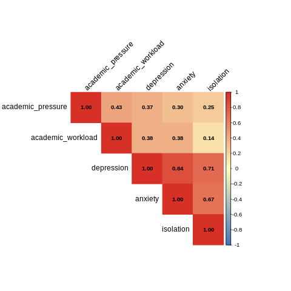

#  Student Mental Health Survey – EDA y Visualización

##  1. Descripción del Dataset

El dataset **Student Mental Health Survey (2024)** recopila información sobre la salud mental de estudiantes universitarios, incluyendo:

- **Bienestar emocional:** ansiedad, depresión, aislamiento, inseguridad frente al futuro.  
- **Factores académicos:** carga de trabajo, presión académica, satisfacción con los estudios.  
- **Hábitos personales:** horas de sueño, actividad deportiva.  
- **Contexto social:** relaciones sociales, presencia o ausencia de discriminación en el campus.  
- **Datos generales:** edad, género, rendimiento académico (CGPA).

El objetivo principal es identificar **qué factores influyen en la salud mental** de los estudiantes y analizar posibles patrones de riesgo.

##  Dimensiones del Dataset y Detalles Técnicos

El dataset utilizado en este proyecto contiene:

- **87 filas (registros de estudiantes)**
- **21 columnas (variables)**

Esto significa que se trata de un dataset pequeño, ideal para análisis exploratorios y visualizaciones sin requerir grandes recursos computacionales.

###  Estructura general de las variables

El dataset incluye diferentes tipos de variables:

- **Numéricas:** `age`, `depression`, `anxiety`, `isolation`, `academic_pressure`, `study_satisfaction`, `academic_workload`, `future_insecurity`, `cgpa`
- **Categóricas (factores):** `gender`, `average_sleep`, `sports_engagement`, `campus_discrimination`, `social_relationships`, etc.

###  Variable objetivo (Target)

Para este análisis, la variable objetivo seleccionada es:

- **`depression`** (escala de 1 a 5)

Esta columna es fundamental porque permite estudiar qué variables se asocian con niveles altos o bajos de depresión en estudiantes universitarios.

También se creó una variable derivada:

- **`high_depression`** → clasifica depresión en:  
  - `"high"` si el valor es **4 o 5**  
  - `"low_medium"` si está entre **1 y 3**

Esto facilita comparaciones y modelos posteriores.

---

##  Conversión de variables *character* a *factor*

Al cargar el dataset en R, varias columnas aparecían como tipo **character**, por ejemplo:

- `gender`  
- `average_sleep`  
- `sports_engagement`  
- `campus_discrimination`

Estas variables no representan texto libre, sino **categorías cerradas**.

Por eso se convirtieron a **factor**, lo cual:

- ✔ Mejora el rendimiento de R en análisis estadístico  
- ✔ Permite generar tablas de frecuencia correctamente  
- ✔ Facilita el uso de `ggplot2` para graficar variables categóricas  
- ✔ Ayuda a identificar el número de niveles (categorías únicas)


---

##  2. ¿Qué se realizó en este proyecto?

Este proyecto incluye un **análisis exploratorio de datos (EDA)** completo usando **R dentro de Google Colab**, integrando librerías como `ggplot2`, `patchwork` y `dplyr`.

Las tareas realizadas fueron:

###  Importación del dataset desde Kaggle  
Usando Kaggle API dentro de Colab.

###  Limpieza y preparación  
- Conversión de variables categóricas a *factor*.  
- Revisión de valores faltantes y duplicados.  
- Exploración de rangos numéricos y valores únicos.

###  Análisis Exploratorio (EDA)  
- Histogramas de ansiedad, depresión y edad.  
- Tablas de frecuencia para entender categorías.  
- Creación de un dataset reducido con las variables más relevantes.

###  Feature Engineering  
Se crearon nuevas variables útiles para análisis:

- `sleep_group` → Agrupa horas de sueño (very_low_sleep, low_sleep, normal_sleep)  
- `sports_binary` → deporte vs no_deporte  
- `high_depression` → depresión alta (4–5) frente a baja/media  
- Eliminación de columnas irrelevantes para salud mental  

###  Visualizaciones  
- Generación de **gráficos clave** para analizar relaciones entre variables académicas, emocionales y sociales.

---

##  3. Estructura del Proyecto

El repositorio debe quedar estructurado de esta manera:

```
📦 student-mental-health-eda
│
├──  README.md
├──  Dataset.ipynb                 # Notebook con análisis EDA
├──  MentalHealthSurvey.csv        # Dataset original usado en Kaggle
│
├──  images                        # Carpeta con gráficas generadas
│     ├── donut_presion_academica.png
│     ├── boxplot_depresion_carga.png
│     ├── heatmap_presion_ansiedad.png
│     ├── barras_discriminacion.png
│     ├── histogramas_emocionales.png
│     ├── matriz_correlacion.png


```

### Importante:
Debes subir **kaggle.json** dentro de la carpeta `sample_data/` en Google Colab para poder descargar datasets desde Kaggle.  

Esto se hace desde:

```
Files → sample_data → Upload → kaggle.json
```

---

##  4. Cómo ejecutar el proyecto desde Google Colab

1. Abrir el notebook `Dataset.ipynb` en Colab.
2. Subir el archivo `kaggle.json` dentro de **sample_data**.
3. Ejecutar todas las celdas en orden:
   - instalación de R y rpy2  
   - instalación de Kaggle API  
   - descarga del dataset  
   - procesamiento, EDA y visualización  

Este proyecto usa código R dentro de Colab gracias al comando:

```python
%load_ext rpy2.ipython
```

Y las celdas R con:

```python
%%R
```

---

##  5. Gráficas más representativas (con análisis)

### 1. Gráfico DONUT – Distribución de la presión académica


**Análisis:**  
La mayoría de los estudiantes se concentra en niveles **altos (4–5)** de presión académica, lo que evidencia un entorno académico exigente.

---

### 2. Boxplot – Depresión según carga académica


**Análisis:**  
A mayor carga académica, mayor dispersión y niveles más altos de depresión.  
Esto sugiere que la exigencia académica está asociada con mayor inestabilidad emocional.

---

### 3. Mapa de calor – Presión académica vs ansiedad


**Análisis:**  
Las combinaciones de presión **4–5** con ansiedad **4–5** son las más frecuentes, indicando una relación directa entre ambas variables.

---

### 4. Gráfico de barras – Discriminación en el campus


**Análisis:**  
Aunque la mayoría no reporta discriminación, existe un grupo significativo que sí la experimenta, lo cual puede impactar negativamente el bienestar emocional.

---

### 5. Histogramas – Edad, ansiedad y depresión


**Análisis:**  
- Predominan estudiantes entre **18 y 22 años**.  
- Ansiedad y depresión muestran concentraciones en niveles **medios–altos**, reflejando un estado emocional vulnerable en parte de la población.

---

## 5. Matriz de correlación entre variables académicas y emocionales



**Análisis:**  
La matriz de correlación permite evaluar la **intensidad y dirección** de las relaciones entre variables numéricas.

- Existe una **correlación fuerte y positiva** entre **depresión y ansiedad**, indicando que suelen aumentar conjuntamente.
- El **aislamiento social** presenta una correlación alta tanto con depresión como con ansiedad.
- La **presión y la carga académica** muestran correlaciones **moderadas** con las variables emocionales, actuando como factores que agravan el malestar psicológico, aunque no lo explican por sí solos.

En conjunto, la matriz evidencia que los factores emocionales están más estrechamente relacionados entre sí, mientras que los factores académicos funcionan como detonantes o amplificadores.

---

## 6. Conclusiones principales

- La presión y la carga académica están asociadas con mayores niveles de ansiedad y depresión.
- El aislamiento social intensifica el malestar emocional.
- La discriminación, aunque menos frecuente, tiene un impacto significativo.
- Las variables emocionales presentan relaciones más fuertes entre sí que con los factores académicos.

---

## 7. Autor

Proyecto desarrollado por **Mariluz García Vera**  
Análisis exploratorio realizado con **R + Python (rpy2)** en Google Colab.
