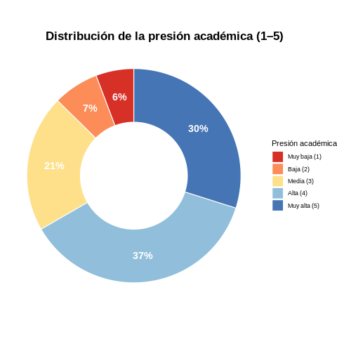
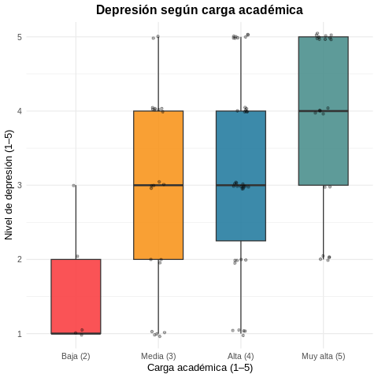
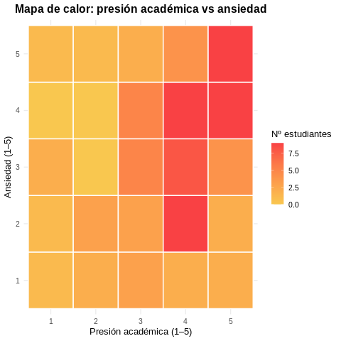
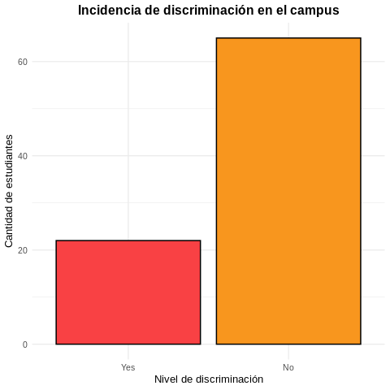
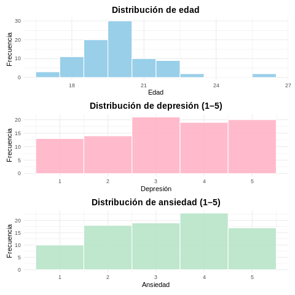

#  Student Mental Health Survey – EDA y Visualización

##  1. Descripción del Dataset

El dataset **Student Mental Health Survey (2024)** recopila información sobre la salud mental de estudiantes universitarios, incluyendo:

- **Bienestar emocional:** ansiedad, depresión, aislamiento, inseguridad frente al futuro.  
- **Factores académicos:** carga de trabajo, presión académica, satisfacción con los estudios.  
- **Hábitos personales:** horas de sueño, actividad deportiva.  
- **Contexto social:** relaciones sociales, presencia o ausencia de discriminación en el campus.  
- **Datos generales:** edad, género, rendimiento académico (CGPA).

El objetivo principal es identificar **qué factores influyen en la salud mental** de los estudiantes y analizar posibles patrones de riesgo.

## 📊 Dimensiones del Dataset y Detalles Técnicos

El dataset utilizado en este proyecto contiene:

- **87 filas (registros de estudiantes)**
- **21 columnas (variables)**

Esto significa que se trata de un dataset pequeño, ideal para análisis exploratorios y visualizaciones sin requerir grandes recursos computacionales.

### 📂 Estructura general de las variables

El dataset incluye diferentes tipos de variables:

- **Numéricas:** `age`, `depression`, `anxiety`, `isolation`, `academic_pressure`, `study_satisfaction`, `academic_workload`, `future_insecurity`, `cgpa`
- **Categóricas (factores):** `gender`, `average_sleep`, `sports_engagement`, `campus_discrimination`, `social_relationships`, etc.

### 🎯 Variable objetivo (Target)

Para este análisis, la variable objetivo seleccionada es:

- **`depression`** (escala de 1 a 5)

Esta columna es fundamental porque permite estudiar qué variables se asocian con niveles altos o bajos de depresión en estudiantes universitarios.

También se creó una variable derivada:

- **`high_depression`** → clasifica depresión en:  
  - `"high"` si el valor es **4 o 5**  
  - `"low_medium"` si está entre **1 y 3**

Esto facilita comparaciones y modelos posteriores.

---

## 🔧 Conversión de variables *character* a *factor*

Al cargar el dataset en R, varias columnas aparecían como tipo **character**, por ejemplo:

- `gender`  
- `average_sleep`  
- `sports_engagement`  
- `campus_discrimination`

Estas variables no representan texto libre, sino **categorías cerradas**.

Por eso se convirtieron a **factor**, lo cual:

- ✔ Mejora el rendimiento de R en análisis estadístico  
- ✔ Permite generar tablas de frecuencia correctamente  
- ✔ Facilita el uso de `ggplot2` para graficar variables categóricas  
- ✔ Ayuda a identificar el número de niveles (categorías únicas)


---

##  2. ¿Qué se realizó en este proyecto?

Este proyecto incluye un **análisis exploratorio de datos (EDA)** completo usando **R dentro de Google Colab**, integrando librerías como `ggplot2`, `patchwork` y `dplyr`.

Las tareas realizadas fueron:

###  Importación del dataset desde Kaggle  
Usando Kaggle API dentro de Colab.

###  Limpieza y preparación  
- Conversión de variables categóricas a *factor*.  
- Revisión de valores faltantes y duplicados.  
- Exploración de rangos numéricos y valores únicos.

###  Análisis Exploratorio (EDA)  
- Histogramas de ansiedad, depresión y edad.  
- Tablas de frecuencia para entender categorías.  
- Creación de un dataset reducido con las variables más relevantes.

###  Feature Engineering  
Se crearon nuevas variables útiles para análisis:

- `sleep_group` → Agrupa horas de sueño (very_low_sleep, low_sleep, normal_sleep)  
- `sports_binary` → deporte vs no_deporte  
- `high_depression` → depresión alta (4–5) frente a baja/media  
- Eliminación de columnas irrelevantes para salud mental  

###  Visualizaciones  
Se generaron **5 gráficos representativos** con análisis detallado (ver sección 4).

---

##  3. Estructura del Proyecto

El repositorio debe quedar estructurado de esta manera:

```
📦 student-mental-health-eda
│
├──  README.md
├──  Dataset.ipynb                 # Notebook con análisis EDA
├──  MentalHealthSurvey.csv        # Dataset original usado en Kaggle
│
├──  images                        # Carpeta con gráficas generadas
│     ├── donut_presion_academica.png
│     ├── boxplot_depresion_carga.png
│     ├── heatmap_presion_ansiedad.png
│     ├── barras_discriminacion.png
│     ├── histogramas_emocionales.png  
```

### Importante:
Debes subir **kaggle.json** dentro de la carpeta `sample_data/` en Google Colab para poder descargar datasets desde Kaggle.  

Esto se hace desde:

```
Files → sample_data → Upload → kaggle.json
```

---

##  4. Cómo ejecutar el proyecto desde Google Colab

1. Abrir el notebook `Dataset.ipynb` en Colab.
2. Subir el archivo `kaggle.json` dentro de **sample_data**.
3. Ejecutar todas las celdas en orden:
   - instalación de R y rpy2  
   - instalación de Kaggle API  
   - descarga del dataset  
   - procesamiento, EDA y visualización  

Este proyecto usa código R dentro de Colab gracias al comando:

```python
%load_ext rpy2.ipython
```

Y las celdas R con:

```python
%%R
```

---

##  5. Gráficas más representativas (con análisis)

### **1️ Gráfico DONUT – Distribución de la presión académica**



**Análisis:**  
La mayor proporción de estudiantes se encuentra en niveles **alto (4)** y **muy alto (5)** de presión académica. Los niveles 1 y 2 representan una parte pequeña.  
Esto evidencia que la mayoría de los estudiantes experimentan **cargas académicas elevadas**.

---

### **2️ Boxplot – Depresión según carga académica**



**Análisis:**  
A medida que aumenta la carga académica, también aumentan las puntuaciones de depresión.  
La variabilidad es baja cuando la carga es mínima, pero se vuelve amplia cuando la carga es alta, lo que indica **inestabilidad emocional asociada a exigencias académicas fuertes**.

---

### **3️  Mapa de calor – Presión académica vs ansiedad**



**Análisis:**  
Las combinaciones de presión **4–5** con ansiedad **4–5** son las más frecuentes (zonas más oscuras).  
Esto indica una **correlación directa entre presión académica y ansiedad**.

---
### **4 Grafico de Barras – Discriminación**

**Archivo:** `barras_discriminacion.png`




**Análisis:**  
Aunque la mayoría reporta **no** haber sufrido discriminación, existe un grupo significativo que sí lo ha experimentado.  
Este tipo de experiencias están asociadas con mayor ansiedad y menor satisfacción académica.

---

### **5 Histogramas de edad, ansiedad y depresión**

**Archivo:** `histogramas.png`



**Análisis:**  
- La mayoría de los estudiantes tiene entre **18 y 22 años**.  
- La ansiedad se distribuye de manera amplia, con picos en niveles 3–4.  
- La depresión muestra un patrón similar, sugiriendo una tendencia generalizada a **niveles moderados-altos de estrés emocional**.

---

##  6. Conclusiones principales

- La presión y la carga académica muestran **relación directa** con ansiedad y depresión.  
- El sueño insuficiente y la falta de deporte agravan los factores de riesgo emocional.  
- La discriminación, aunque menos frecuente, tiene un fuerte impacto negativo.  
- Las relaciones sociales funcionan como **factor protector**, reduciendo los niveles de ansiedad.  

Este análisis permite identificar patrones clave para intervenciones y estrategias de bienestar estudiantil.

---

##  7. Autor

Proyecto desarrollado por **Mariluz García Vera**  
EDA realizado con **R + Python (rpy2)** en Google Colab.

